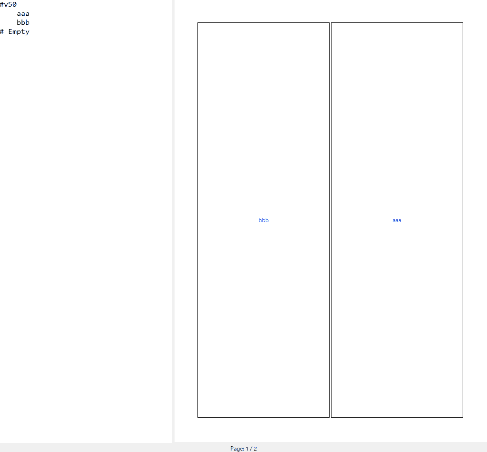

# Manga Score



## 🎹 Basic Score Format
This editor describes the hierarchical structure of a manga page using "indents" and "commands."
1. Split Rules
Lines starting with # are split commands.
- #h[ratio]: Horizontal split. Divides the area into top and bottom.
- #v[ratio]: Vertical split. Divides the area into left and right.
- [ratio]: A value from 0 to 100. For example, #v50 means "split exactly in half, left and right."

2. Hierarchical Structure via Indentation
Use indentation (4 spaces) to "split a split area" further. 
```
#h60          <-- Parent: Splits the page 60:40 (top and bottom)
    #v50      <-- Child: Splits the top 60% area into 50:50 (left and right)
        aaa   <-- Panel: Top-Left
        bbb   <-- Panel: Top-Right
    ccc       <-- Panel: Bottom 40% area
```
3. Labels (Dialogue & Notes)
Any line that does not start with # is treated as a Label. You can freely write dialogue drafts or directorial notes (e.g., "Flashback," "Close-up") to be displayed inside the panel.

## 💡 Score Example (One Full Page)
Here is an example of a score representing a single manga page layout.
```
#h20
    Title Logo
#h60
    #v70
        #h50
            1. Protagonist looking surprised
            2. Enemy's feet approaching
        3. Explosion effect (Large panel)
    4. Exposition monologue
#h20
    #v50
        5. To be continued!
        6. Editor's teaser text
```

# Manga Score Editor 🖋️

"Layout at the speed of thought. A text-driven, lightweight storyboard editor."

Manga Score Editor is a specialized layout design tool for manga storyboarding (Name).It eliminates complex operations by merging text-based structural definition with intuitive mouse controls.

## 🚀 Key Features

- Scoring Layout: Generate panel layouts instantly from indented text structures (Scores).
- Recursive Resizing: Drag boundaries to resize panels in real-time. Sub-panels maintain their proportions automatically.
- Digital-Native Design: Built-in manga logic—automatically implements standard spacing (wide vertical gutters, narrow horizontal gutters).
- Lightweight Response: Based on the standard library (Tkinter). Even with complex layouts, it remains incredibly snappy.
- Bulk Transparent PNG Export: Export all pages with a single click for immediate integration with software like CLIP STUDIO PAINT.

## 🖱️ 基本操作

- Left Click: Split panel horizontally.
- Right Click: Split panel vertically.
- Middle Click: Edit label (Dialogue/Notes).
- Drag Boundary: Adjust split ratio (Child elements follow automatically).
- Double Click Boundary: Remove split.
- Ctrl+Shift+A / D: Switch pages.
- Ctrl+Z / Y: Undo / Redo.

## 🛠️ Requirements
- Python 3.x
- Pillow (Image Export)

